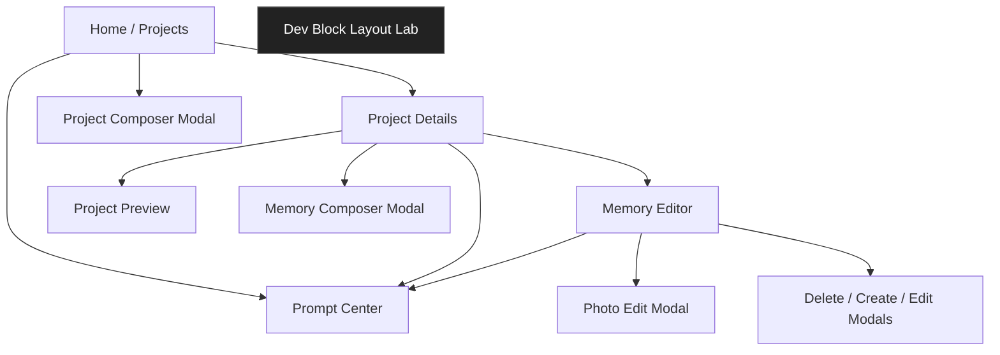
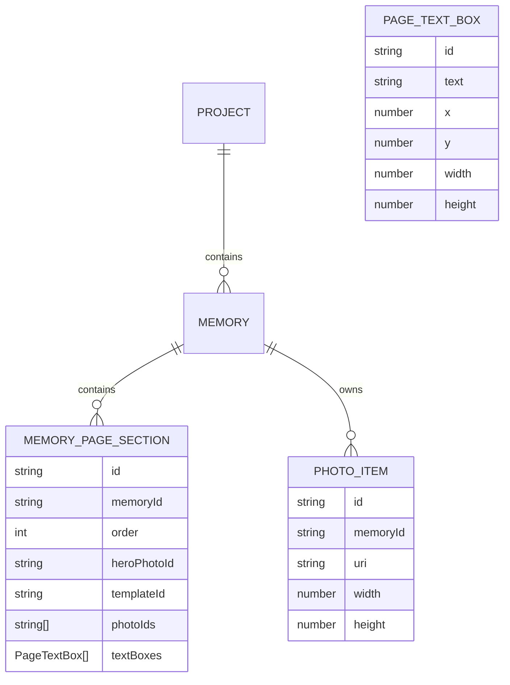
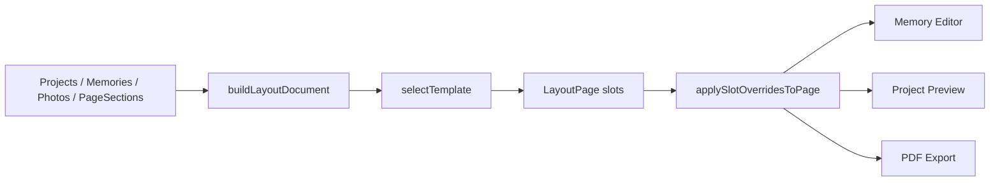
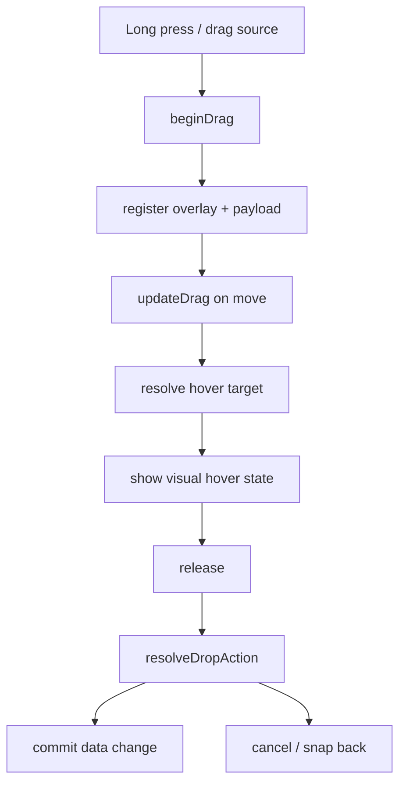

# YearBook App Architecture

## Purpose
This document describes the current architecture of the YearBook app as it exists in this repository today.

It is intended for developers who need to understand:
- what the app currently does
- how the main screens relate to one another
- where data lives
- how layout generation works
- how drag, editing, preview, and export fit together

This repo has evolved past the original MVP described in `README`. Treat this file as the current architectural reference.

## Tech Stack
- Expo managed app
- Expo Router for screen routing
- React Native 0.81
- TypeScript
- AsyncStorage for local persistence
- Zustand for editor override state
- Zod for layout schema validation
- `react-native-draggable-flatlist` for memory/page reorder
- custom drag system for photo and gallery drag/drop

## Product Overview
The app is a local-first photobook builder.

The user flow is:
1. Create a project
2. Create memories inside the project
3. Add photos to each memory
4. Split memory photos into pages
5. Apply a page template
6. Edit photo crop/fit/position, page styling, and text overlays
7. Preview the book
8. Export/share a PDF

## Screen Map


## Main Routes

### `app/index.tsx`
Home / projects overview.

Responsibilities:
- list projects
- show project thumbnail + summary stats
- open project
- create project
- edit project title/thumbnail
- delete project
- expose bottom toolbar actions

### `app/project/[id].tsx`
Project details screen.

Responsibilities:
- show project title and aggregate stats
- list memories as large preview cards
- reorder memories
- create memory
- edit memory title/thumbnail
- delete memory
- open memory editor
- open preview
- launch PDF export/share flow

### `app/memory/[id].tsx`
Primary editing surface.

Responsibilities:
- render one active page at a time
- select/reorder pages
- apply page template/style options
- manage extra photos strip
- support photo drag/swap/add/remove
- photo crop/zoom/position editing
- create/edit/delete text boxes
- delete pages while keeping or discarding photos

### `app/project/[id]/preview.tsx`
Project preview.

Responsibilities:
- build the layout document for the whole project
- render page-only previews
- reflect editor overrides

### `app/prompts.tsx`
Prompt center.

Responsibilities:
- show generated suggestions from current local data

### `app/dev/block-layout-lab.tsx`
Internal dev tool.

Responsibilities:
- experimental sandbox for block layout logic
- not part of the main user workflow

## Repo Structure
```text
app/
  _layout.tsx                  Expo Router root
  index.tsx                    Home / projects overview
  memory/[id].tsx              Main memory editor
  project/[id].tsx             Project details
  project/[id]/preview.tsx     Book preview
  prompts.tsx                  Prompt center
  dev/block-layout-lab.tsx     Internal layout sandbox

src/
  constants/
    projectTypes.ts            Project type definitions

  context/
    AppContext.tsx             Main app data store and actions

  editor/
    drag/
      types.ts                 Shared drag payload/target types
      dragController.ts        Drop resolution rules
      dragTargets.ts           Hit-testing and target filtering
      useDragInteraction.ts    Shared drag lifecycle hook
      DragOverlay.tsx          Floating drag preview

  layout/
    engine.ts                  Builds layout pages/documents
    templates.ts               Template library and selection logic
    pagination.ts              Default photo-to-page grouping
    schemas.ts                 Zod schemas for layout data
    overrides.ts               Applies slot overrides to layouts
    photoMetrics.ts            Shared image crop/render math
    blockTool/                 Experimental block solver engine

  services/
    exportService.ts           PDF generation + share
    photoService.ts            Photo import/picking helpers
    promptEngine.ts            Suggestion generation

  state/
    editorStore.ts             Persistent slot override store

  lib/
    id.ts                      Local id helpers

  storage.ts                   AsyncStorage load/save
  types.ts                     Core domain types
```

## Core Domain Model
The canonical data model lives in `src/types.ts`.



### Key Types
- `Project`
  - app-level container
  - owns memories
- `Memory`
  - logical content group inside a project
  - has ordered pages and memory photos
- `MemoryPageSection`
  - page-level content membership and styling
  - stores `photoIds`, `templateId`, page styles, and `textBoxes`
- `PhotoItem`
  - imported photo metadata and file URI
- `PageTextBox`
  - freeform text overlay positioned on a page

## State Model
There are two different state layers by design.

### 1. Canonical app data
Stored in `src/context/AppContext.tsx` and persisted by `src/storage.ts`.

Contains:
- projects
- memories
- page sections
- photos

This is the source of truth for content structure.

### 2. Editor override state
Stored in `src/state/editorStore.ts`.

Contains:
- per-page / per-slot overrides:
  - slot geometry
  - `photoId` swaps
  - `fitMode`
  - `photoScale`
  - `photoOffsetX`
  - `photoOffsetY`

This is the source of truth for editing adjustments that should not rewrite the canonical page template layout on every change.

## Persistence
`src/storage.ts` persists `AppData` into a single AsyncStorage key:
- `projects`
- `memories`
- `pageSections`
- `photos`

The editor override store is persisted separately through Zustand middleware.

This means:
- content structure is persisted independently
- crop/reposition/slot swap state is persisted independently

## Layout System
The layout system is template-driven.

Relevant files:
- `src/layout/engine.ts`
- `src/layout/templates.ts`
- `src/layout/pagination.ts`
- `src/layout/schemas.ts`
- `src/layout/overrides.ts`
- `src/layout/photoMetrics.ts`

### Current behavior
- pages are square
- slot frames are normalized to `0..1`
- memory photos are split into page sections
- a page template is selected based on:
  - photo count
  - hero photo
  - orientation fit
- resulting layout pages are validated through Zod schemas

### Layout pipeline


### Shared photo rendering math
`src/layout/photoMetrics.ts` centralizes:
- cover/contain sizing
- aspect-aware image dimensions
- clamp logic for offsets
- scale bounds

This is important because it keeps:
- memory editor
- preview
- export

visually consistent.

## Pagination and Page Structure
Default page grouping is not arbitrary freeform auto-layout anymore.

The code in `src/layout/pagination.ts` and `src/layout/engine.ts` currently favors:
- a single-photo first page
- a two-photo second page
- then up to four photos per later page

Each page section can then:
- keep auto template selection
- or hold a user-selected template override

## Editing Model
The main editing surface is `app/memory/[id].tsx`.

### Photo editing
Photo edit state is stored as slot overrides:
- `fitMode`
- `photoScale`
- `photoOffsetX`
- `photoOffsetY`

The photo editor:
- keeps the photo visually clipped by the slot
- still allows access to hidden image area during repositioning
- uses the same crop math as preview/export

### Page styling
Page sections hold:
- background color
- slot border color
- slot border width
- slot corner radius
- text defaults

### Text boxes
Text boxes are page-level overlays.

Capabilities:
- add
- select
- edit text
- drag
- resize
- delete
- style text/border/fill

Outside text mode, they are treated as visually present but not interactive for photo manipulation.

## Drag and Gesture Architecture
The app intentionally uses two different drag approaches.

### A. Library-owned reorder
Used for:
- memory reorder on project screen
- page reorder on memory screen

Implemented with:
- `react-native-draggable-flatlist`

Reason:
- reorder interactions were the least reliable in the custom system
- library-owned same-gesture drag is more stable

### B. Custom drag controller
Used for:
- page photo -> page photo swap
- page photo -> gallery remove/swap
- gallery photo -> page add/swap

Implemented in:
- `src/editor/drag/types.ts`
- `src/editor/drag/dragController.ts`
- `src/editor/drag/dragTargets.ts`
- `src/editor/drag/useDragInteraction.ts`
- `src/editor/drag/DragOverlay.tsx`

Design goals:
- transient drag state only during gesture
- floating overlay under the finger
- explicit hover feedback
- commit on release only
- invalid drops snap back

### Drag flow


## AppContext Responsibilities
`src/context/AppContext.tsx` is the highest-value file to understand first.

It handles:
- project CRUD
- memory CRUD
- page section CRUD
- page reorder
- memory reorder
- photo import / attachment
- move photo to page
- remove photo from page
- text box CRUD
- thumbnail picking
- page-section reconciliation

If a feature changes data ownership or page membership, it usually passes through `AppContext`.

## Services

### `src/services/photoService.ts`
Handles:
- image picking
- asset import
- image metadata capture
- optional location metadata support

### `src/services/exportService.ts`
Handles:
- layout document generation for export
- HTML/PDF creation
- sharing exported PDF

### `src/services/promptEngine.ts`
Handles:
- prompt suggestions based on:
  - time interval
  - photo spike
  - location pattern

## Preview and Export
The preview screen and export service both consume the same layout document path:
- `src/layout/engine.ts`
- `src/layout/overrides.ts`
- `src/layout/photoMetrics.ts`

This is one of the cleaner parts of the architecture now:
- editor output
- preview output
- export output

are intentionally converging onto the same render assumptions.

## Internal / Experimental Area
`app/dev/block-layout-lab.tsx` and `src/layout/blockTool/*` are internal tooling for experimental layout behavior.

These files are valuable for:
- testing spatial layout logic
- solver experimentation
- future richer auto-layout behavior

They are not currently the primary production page-layout path.

## Current Strengths
- clear route separation
- local-first data model
- template-driven page generation
- persistent crop/slot overrides
- shared photo render math across editor/preview/export
- memory editor is now the main creative surface
- page and memory reorder use more reliable library-owned drag

## Current Rough Edges
- some drag interactions still need polish even though the architecture is much better
- text editing works, but the UX is still evolving
- prompt center is functional but visually behind the newer dark-shell screens
- README is outdated compared with the actual product state

## Suggested Reading Order for New Contributors
1. `src/types.ts`
2. `src/context/AppContext.tsx`
3. `src/layout/engine.ts`
4. `src/layout/templates.ts`
5. `src/layout/photoMetrics.ts`
6. `app/index.tsx`
7. `app/project/[id].tsx`
8. `app/memory/[id].tsx`
9. `src/editor/drag/useDragInteraction.ts`
10. `src/services/exportService.ts`

## Practical Mental Model
If you want to reason about the app quickly, use this model:

```text
Project
  -> owns memories
Memory
  -> owns photos
  -> owns ordered page sections
Page section
  -> chooses template
  -> owns page styles
  -> owns text boxes
Layout page
  -> generated from template + page section membership
Editor overrides
  -> modify slot crop/placement without rewriting template structure
```

That separation is the main architectural idea behind the current codebase.
